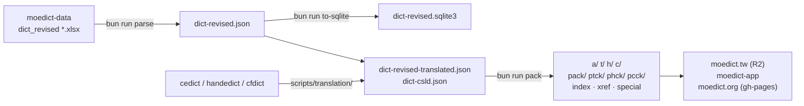

moedict-process
===============

萌典（moedict）的資料工廠。從教育部官方原始檔出發，產出
[moedict.tw](https://www.moedict.tw/)、離線 App 與凍結版
[moedict.org](https://www.moedict.org/) 所需的全部字典資料 —— 解析、翻譯整併、
打包（pack）、索引與跨語言對照，一律在本 repo 完成。
Bun / TypeScript implementation, with LemmaScript-verified core models.

自 2026-07-10 起，本 repo 取代 `moedict-webkit` 的 LiveScript / Perl / Python 2
pack 工具鏈，成為唯一的資料重建路徑（見〈Downstream consumers〉）。



Requirements
------------

* [Bun](https://bun.com/) ≥ 1.3
* Optional: `xz` on `PATH`（產 `dict-revised.json.xz` 用，缺少則跳過）
* Optional: Python 3.9+ 與 `lxml`（只有 `scripts/translation/` 需要）：
  `pip install -r scripts/translation/requirements.txt`
* Optional: [Dafny](https://dafny.org/) 4.9 + `lemmascript`（跑 `bun run verify` 用）

```sh
bun install
```

Pipeline stages
---------------

| Stage | Command | Input | Output |
|-------|---------|-------|--------|
| Parse | `bun run parse`（或 `make json`） | `dict_revised/*.xlsx` | `dict-revised.json`(.xz) |
| SQLite | `bun run to-sqlite`（或 `make db`） | `dict-revised.json` | `dict-revised.sqlite3` |
| Translate | `scripts/translation/*.py` | cedict / handedict / cfdict + 上列 JSON | `dict-revised-translated.json`、`dict-csld.json` |
| Pack | `bun run pack [a\|t\|h\|c\|all]` | 各語系來源 JSON | 完整 pack 輸出樹 |

### Stage 1 — Parse（國語辭典）

官方 `.xlsx` 放在 [`g0v/moedict-data`](https://github.com/g0v/moedict-data)，
先下載到 `dict_revised/`：

```sh
mkdir dict_revised
cd dict_revised
wget https://raw.githubusercontent.com/g0v/moedict-data/main/dict_revised/dict_revised_1.xlsx
cd ..
bun run parse       # → dict-revised.json (.xz)
bun run to-sqlite   # → dict-revised.sqlite3
```

環境變數可覆寫預設路徑：

| 變數 | 預設值 |
|------|--------|
| `MOEDICT_SOURCE_DIR` | `dict_revised` |
| `MOEDICT_OUTPUT` / `MOEDICT_JSON` | `dict-revised.json` |
| `MOEDICT_DB` | `dict-revised.sqlite3` |
| `MOEDICT_SCHEMA` | `dict-revised.schema` |

### Stage 2 — Translations（英/法/德 + 兩岸詞典）

`scripts/translation/` 是 `moedict-webkit/translation-data` 的 Python 3 移植：

- `xml2txt.py` — CFDICT XML → cedict 格式文字
- `txt2json.py` — 把 cedict / cfdict / handedict 併入國語辭典
  → `dict-revised-translated.json`（pack 階段偏好此檔）
- `csld2json.py` — 同樣整併兩岸詞典 → `dict-csld.json`（`pack c` 的輸入）

用法、路徑參數與授權見
[`scripts/translation/README.md`](scripts/translation/README.md)。
對照表 CC-CEDict、CFDict、HanDeDict 均為 CC BY-SA 4.0 國際授權。

### Stage 3 — Pack

```sh
MOEDICT_PACK_INPUT=<inputDir> MOEDICT_PACK_OUTPUT=<outputDir> \
  bun run pack a        # a=國語 t=臺灣台語 h=臺灣客語 c=兩岸 | all
```

| 環境變數 | 預設值 | 說明 |
|----------|--------|------|
| `MOEDICT_PACK_INPUT` | `dict_data` | 來源目錄（見下） |
| `MOEDICT_PACK_OUTPUT` | `.` | 輸出目錄 |
| `PACK_CONCURRENCY` | CPU 數 | autolink worker 數；`1` = 單執行緒 |

輸入目錄放各語系來源：`dict-revised-translated.json`（或
`dict-revised.json`）、`dict-twblg.json` + `dict-twblg-ext.json`、
`dict-hakka.json`、`dict-csld.json`、`dict-concised.audio.json`（選用），
以及 xref 對照側輸入 `x-華語對照表.csv` 與 `work-in-progress.json`。

輸出為 moedict 前後端消費的完整資料樹：逐條目 JSON（`a/ t/ h/ c/`）、
bucket 檔（`pack/ ptck/ phck/ pcck/`）、`index.json`、`xref.json`、
`lenToRegex.*.json` / `precomputed.json`、`@部首` 與 `=分類` 特殊檔。
逐檔格式規格（含排序、跳字規則與已知差異）：
[`docs/pack-format-contract.md`](docs/pack-format-contract.md)。

**PUA policy** — 輸出必須不含私用區字元：`assertNoPua` 把關所有輸出面。
僅三組經考據的例外以指名方式放行或轉換：

1. `VARIANT_PUA_ALLOWLIST` — 131 個 `revised-dict.woff` 第 15 平面 MOE 異體字（原樣通過）
2. `HAKKA_LITERAL_PUA` — 16 個客語 BMP-PUA 字元（僅 `h`）
3. `src/pack/csld-pua.ts` — 兩岸詞典 3 個 Big5 時代殘留（載入時轉為正式碼位：
   `U+E38F→著`、`U+E840→䓖`、`U+F8F8→刪除`）

其餘一律 hard-fail 並附語系/詞條脈絡；不靜默剝除、不猜測對應。

Verification & tests
--------------------

```sh
bun test                 # 216 tests: unit + property + integration
bun run typecheck        # tsc strict
bun run lint             # eslint
bun run test:coverage    # coverage report
bun run stryker          # mutation testing
bun run verify           # LemmaScript → Dafny：驗證 src/pack 核心模型
```

`src/pack/{codepoint,bucket,prefix,serializer,…}.ts` 帶 LemmaScript `//@` 規格，
由 Dafny 後端驗證（`LemmaScript-files.txt` 列出驗證範圍）。JS `RegExp`、
`JSON.stringify`、檔案系統與 audio-map 啟發式屬明示的信任邊界，由測試涵蓋。

### Golden tests（legacy 對照）

`tests/pack/golden-output.test.ts` 以凍結的 legacy 輸出子集
（`tests/pack/fixtures/legacy/`，含 manifest 與出處紀錄）驗證 pack 對舊管線的
對等性。設好輸入即整套執行，未設則自動略過：

```sh
MOEDICT_PACK_INPUT=<inputDir> MOEDICT_PACK_CONCURRENCY=18 \
  bun test tests/pack/golden-output.test.ts
```

- `a` / `h` / `t` / `c` 各語系獨立 golden 區塊；`c` 需要 `dict-csld.json`
  在輸入目錄內才會啟用
- `c` 的輸入釘在 `moedict-data-csld@f7bd225`（fixture 年代；HEAD 有 432 處
  編輯漂移）— 重建指令見 fixtures README
- 比較模式（逐位元 / 結構性 / 語意）與所有已知漂移都記載於
  [`tests/pack/fixtures/legacy/README.md`](tests/pack/fixtures/legacy/README.md)

Output conventions
------------------

為保持字典 JSON 順序穩定，本實作固定：

- `JSON.stringify` 手動 sort keys（`canonicalJson` 與 legacy `sort-json.pl` 逐位元相同）
- Array / title sort 以 Unicode codepoint 比較，非 UTF-16 code unit
  （`U+FA3E` 的相容漢字 vs `U+2000D` 等超平面字的排序會錯）
- Bucket 行序與 bucket key 依 UTF-8 位元組序（等同 `LC_ALL=C sort`）
- `parseDefs` 的 line-strip **不**剝除 U+FEFF（與 `String.prototype.trim()` 不同），
  否則帶 BOM 的條目會被誤分類

詳見 `src/process.ts::codepointCompare` 與 `src/parse.ts::stripDefLine`。

### Dedup behaviour — 花枝招展 bug

舊版以整份 heteronym 序列化字串做去重，碰到 `b` 欄位一份 ASCII 空白、一份
U+3000 全形空白的雙胞胎條目時判定為不同，兩份都留下，導致下游 `moedict.tw`
同一詞條顯示兩次釋義（影響 33,699 個詞彙，如「花枝招展」、「耀眼」、「退件」）。

`src/dedup.ts` 改以正規化後的 `(bopomofo, pinyin)` 做識別鍵；相同鍵出現多次時，
保留序列化後較長、內容較完整的那份。既有輕聲 / 非輕聲變體（同 `audio_id` 但
bopomofo 不同）不受影響。

Downstream consumers
--------------------

| Consumer | 取用方式 |
|----------|----------|
| [`g0v/moedict.tw`](https://github.com/g0v/moedict.tw) | pack 輸出進 `data/dictionary/`，再以其 scripts 產全文檢索與拼音索引後上傳 R2 |
| [`g0v/moedict-app`](https://github.com/g0v/moedict-app) | `scripts/prepare-data.sh` 從 moedict.tw 樹複製 |
| [`g0v/moedict-webkit`](https://github.com/g0v/moedict-webkit) | 凍結的 moedict.org 靜態前端（gh-pages 供檔）；其 pack 工具鏈已於 2026-07-10 退役，由本 repo 接手 |

See also
--------

* Pack format spec: [`docs/pack-format-contract.md`](docs/pack-format-contract.md)
* Data source: https://github.com/g0v/moedict-data/tree/main/dict_revised
* Project site: http://3du.tw/ ( https://g0v.hackpad.tw/3du.tw-ZNwaun62BP4 )
* Bug tracker: https://github.com/g0v/moedict-process/issues
* Slack: g0v-tw #moedict <https://app.slack.com/client/T02G2SXKM/C8DEZ566S>
